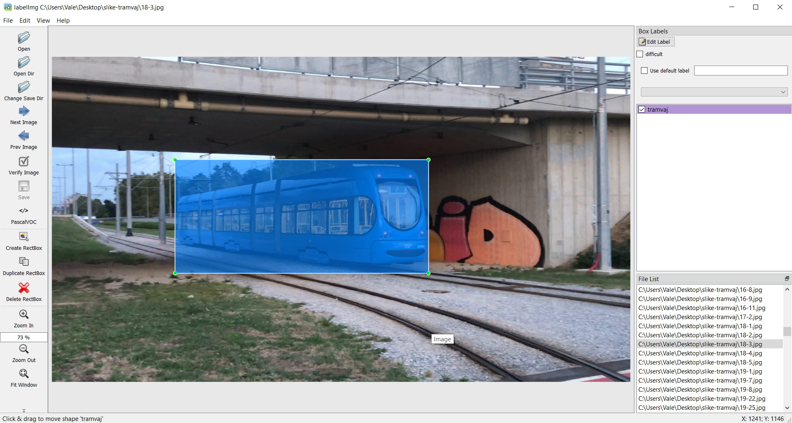
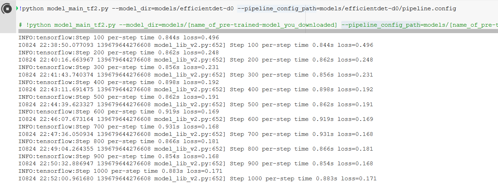
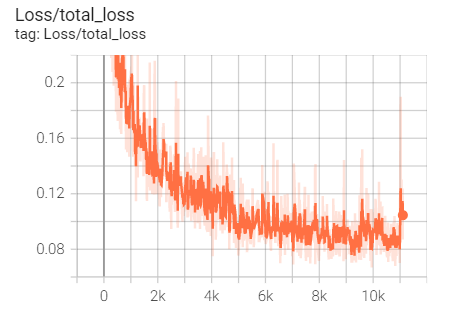
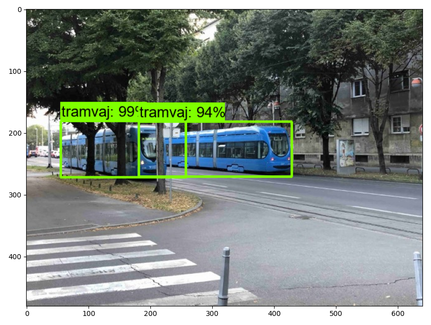

# Training a Custom TensorFlow 2 model using Tensorflow's object detection API and transfer learning
Object detection on trams in Croatia's capital city Zagreb. Object detection is performed on images, local video or webcam.

## Introduction

This guide provides step-by-step instructions for how to set up TensorFlow’s Object Detection API on Windows device, set up and train model to perform object detection and run inference. There is also example on Google collab.

Google collab is included with output.

## Table of Contents
1. [Installing TensorFlow and TensorFlow Object Detection API](#1installing-tensorflow)
2. [Preparing our Workspace](#2preparing-our-workspace)
3. [Gathering and Labeling our Dataset](#3gathering-and-labeling-our-dataset)
4. [Generating Training Data](#4generating-training-data)
5. [Training the Model](#5training-the-model)
6. [Exporting the Model](#6exporting-the-model)

## The Steps
# 1.Installing TensorFlow

INFO: Skip local installation if Google Collab is enough for your requirements.

We need to install Python 3.7.9., TensorFlow 2.5, Nvidia CUDA 11.2 and CuDNN 8.1.

Python can be installed from official website (add it to PATH), then using pip command install tensorflow 2.5 from CMD
```
pip install tensorflow==2.5
```
Nvidia CUDA can be installed from [here](https://developer.nvidia.com/cuda-toolkit-archive). Select version 11.2.0.

After Succesfull instalation, CuDNN library sould be also installed. Download it from [here](https://developer.nvidia.com/rdp/cudnn-archive). Version should fit for installed Nvidia CUDA toolkit version.
Downloaded archive should be extracted to directory where Nvidia CUDA Toolkit was installed. In my case it's "C:\Program Files\NVIDIA GPU Computing Toolkit\CUDA\v11.2\". If asks to override some files, agree.

You can install newer version as long as they are compatible.

To vefiy installation, enter following commands to CMD
```
python
```
After that cmd should print installed python version in console. Next comamnd is:
```
import tensorflow as tf
```
where log should be that dynamic library is successfully opened. Final command that tests if GPU is recognized is:
```
tf.config.list_physical_devices('GPU')
```
If logs in console lists several successfully opened libraries and lists a GPU that everything works so far.

# TensorFlow Object Detection API installation
There are a lot of complications with installing TF-API, I've been using this simpler [solution](https://pypi.org/project/tf-models-official/#history):
```
pip install tf-models-official
```
Where you can select version for current or older tensorflow version. I think that you don't need to match versions here as it has worked for me.
This will also install all other dependecies such as tf-slim, pycocotools,open-cv...

# Protobuf Installation/Compilation
Position yourself in "TensorFlow/models/research/" using cd comamnd in CMD
My path is : "C:\Users\Vale\AppData\Local\Programs\Python\Python37\Lib\site-packages\tensorflow\models\research"

cd "Path-to-research-folder" then enter following command:
```
for /f %i in ('dir /b object_detection\protos\*.proto') do protoc object_detection\protos\%i --python_out=.
```
After successfull compilation, next step in installation:
Position yourself in: "TensorFlow/models/research/object_detection/packages/tf2" and copy setup.py to "TensorFlow/models/research/" and run this command:
```
python -m pip install --use-feature=2020-resolver .
```
Everything should be successfully installed. To test installation run following command from "TensorFlow/models/research/":
```
python object_detection/builders/model_builder_tf2_test.py
```
Log should return all test OK, if some are skipped, ignore that. In my case it is 1 skipped test.

**Note that Visual C++ 2015 build tools must be installed and on your path, according to the installation instructions. If you do not have this package, then download it [here](https://go.microsoft.com/fwlink/?LinkId=691126).**

# 2.Preparing our workspace 

Inside "/tensorflow/" directory create another folder called "workspace"
Inside workspace/ create following directories:
 1. annotations
 2. exported-models
 3. models
 4. pre_trained_models

Folder annotations will contain data for traning, exported-models is where models will be exported for them to be used on inference (detection). Folder models will contain models that are being trained will all data and pre_trained_models will contain downloaded models on which we will train our model using transfer learning.

# 3.Gathering and Labeling our Dataset

In repo there are only several images as examples due to possible privacy violations.
Using iPhone X, I have recorded several videos in 4K, 24 fps mode. Trams in vidoes are in various angles... from front, side and back. All videos were recorded from avarage person's POV.

Using FFmpeg, vidoes are converted to images. In cmd, position yourself in the same directory as the video and using the following command in cmd: 
```
ffmpeg -i input_video.mov -vf fps=1 out%d.png
```
extracts images every second from video. That way we will get multiple angles of tram and it is easy way to get a lot of images. Every image is named: out1.png, out2.png... If frame is needed  every half a second than fps=2/1. My advice is to name every video for processing video1.mov, video2.mov etc. and then images parametar should follow "out1-%d.png" for video1.mov and "out2-%d.png" for video2.mov so images could be easily assigned where were they from.

### Compressing
Extracted images will have around 10 MB in memory so compressing is needed. Using 
1. image resizer for windows
2. imagine

Images were compressed to FULL HD and using converted to jpg in bulk using imagine.
Now images weight around ~300KB.

### Labeling the images
Images were labeled in "LabelImg". Load image folder in program and carefully label each tram or desired object on images. Bounding boxes should go around object so entire tram can fit in, but not to loosely.
Desired format is: PascalVOC



# 4.Generating Training Data

Folder where are images should now also contain XML files for each image. If you have less than 1000 images in total, as I have around 340 images, it is easier to use website "Roboflow" for generating training data. For more than 1000 images, you can find script online for generating TFrecord files.

Create account on roboflow and upload folder containing images and its XML files. Assign around 70%-80% for training set and the remaining images put to validation. Select resolution the same as the desired model (see next chapter for list of models. I used EfficientDet-d0 512x512) so images have 512x512 resolution with added black edges "Fit (black edges)"" so there is no distortion. There were no augmentations

Select Export -> other -> TensorFlow TF record. Download zip and extract archive.
From any folder select "tram_label_map.pbtxt" and rename it to "label_map.pbtxt" and copy it to "annotations" folder. Inside train folder rename "tram.tfrecord" to "tram-train.tfrecord" and in valid folder do the same and rename it to "tram-valid.tfrecord". Copy those two renamed files to annotations folder.

## Downloading the model

From the following [link](https://github.com/tensorflow/models/blob/master/research/object_detection/g3doc/tf2_detection_zoo.md) select the model that fits within your parametars. EfficientDet is one of the newest and best performing models. Because of my weak GPU, I've selected EfficientDet-D0. If you have GPU with more than 16GB VRAM, you can use more demanding models as EfficientDet-D4 and others. Some models have lower accuracy but higher inference speed so they are reccomended for weaker hardware like mobile phones (e.g. SSD MobileNet v2 320x320). Number of images used in training combined with batch_size will eat up GPU memory. Feel free to experiment with different models and settings (will be covered in next chapter). Research models and weight their pros and cons.

For now, I've been using EfficientDet-D0. 
-> Download and extract zip archive and copy folder "efficientdet_d0_coco17_tpu-32" to "/pre_trained_models/" folder. 
Go in /models/ folder and create folder named "efficientdet_d0-v1". 
-> Copy "pipeline.config" from downloaded model in "/pre_trained_models/" to "efficientdet_d0-v1/".

# 5.Training the Model

Training can be done locally or in cloud. If you have hardware (especially GPU) to support local training, do it on your PC. I'll be using cloud for GPU, online service called Google Collab.
In Repo there is example of Google collab file.
Procedure is similar and easier to do locally, so you can follow Google collab tutorial as guide.

Open Colab and open Notebook.
Select the Hardware Accelerator, go to Runtime→Change Runtime Type and select Hardware accelerator as GPU.

Go to your Google Drive and make a new folder named “TensorFlow”. Inside make another folder called workspace and create the same folder as before.

Follow steps from Google collab file up to "Train the model".

# Configure pipeline.config file

This file is used for configuring training parametars.
Edit the following parametars(this is specifically for efficientdet but it's similar for all models):
1: num_classes: 1 (number of different objects. tram is 1, if you have e.g. cars then 2 etc.)
2: batch_size: 12 (try 16 or 32 if possible). Depends on size of images and avaible GPU memory. see [this](https://machinelearningmastery.com/difference-between-a-batch-and-an-epoch/) for more.
3:  learning_rate_base:0.019999992 (Learning rate should follow batch size. Original batch size is 128, but we use 12 so in our case batch size is ~8 times smaller. Because of that learning rate should be reduced and with it the following "warmup_learning_rate")
4:warmup_learning_rate: 0.0010000000474974513
5:warmup_steps: 2500

6:fine_tune_checkpoint: "/content/gdrive/MyDrive/TensorFlow/workspace/pre_trained_models/efficientdet_d0_coco17_tpu-32/checkpoint/ckpt-0"
7:fine_tune_checkpoint_type: "detection"
8:use_bfloat16: false (True if TPU is used.)

**train_input_reader**
9:label_map_path: "/content/gdrive/MyDrive/TensorFlow/workspace/annotations/label_map.pbtxt"
10:input_path: "/content/gdrive/MyDrive/TensorFlow/workspace/annotations/tram-train.tfrecord"

**eval_input_reader**
11:label_map_path: "/content/gdrive/MyDrive/TensorFlow/workspace/annotations/label_map.pbtxt"
12:input_path: "/content/gdrive/MyDrive/TensorFlow/workspace/annotations/tram-valid.tfrecord"

**Extra**
"iou_threshold" has been lowered to 0.40. This is usually at 0.50 and be 100% sure what this means if you want to lower the value.
----------------------------------------------------------------------------------------
# Training is started using following command:
```
!python model_main_tf2.py --model_dir=models/"name_of_model" --pipeline_config_path=models/"name_of_model"/pipeline.config
```

Follow Collab file as example. Name should be entered without "".
After 30 or so seconds, training will start (see image)



Training should be stopped when we see that "loss" is converging. This is example:
image-loss-250



Training can be stopped and continued later. To do so, edit checkpoint in pipeline.config to path to "workspace/models/efficient-det-d0-v1/ckpt-X" where X is highest checkpoint number.

# 6.Exporting the Model
Models is exported so it be used for inference. 
```
!python exporter_main_v2.py --input_type image_tensor --pipeline_config_path models/"name_of_model"/pipeline.config --trained_checkpoint_dir models/"name_of_model"/ --output_directory exported-models/my_model_"name_of_model"
```
Model be downloaded and locally ran (see repo for image,video or webcam example) or following the Collab, run inference on images.

If everything was successful, output should show image with class and bounding box




    
    
